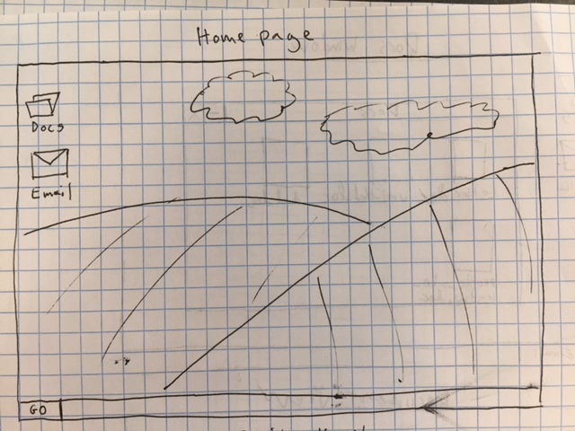
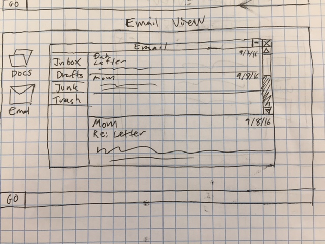
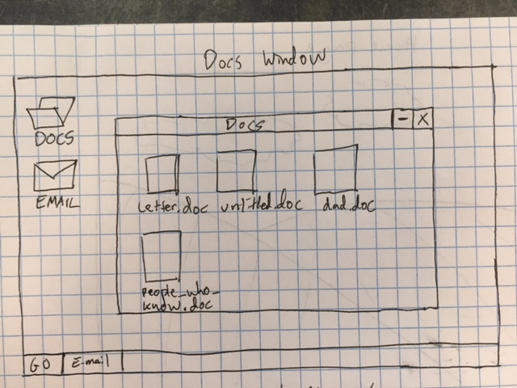
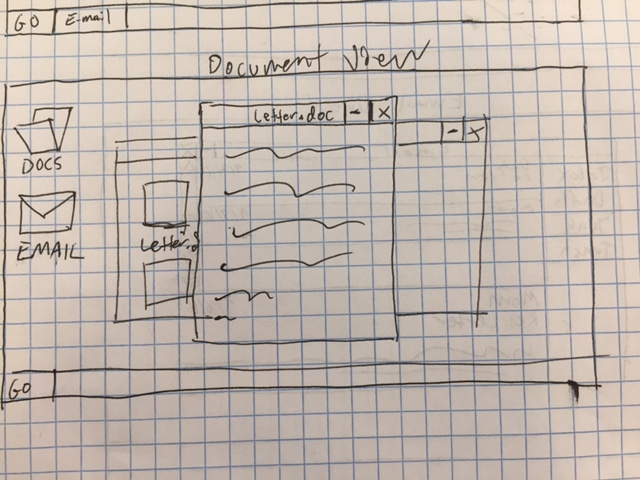

# Brick By Brick

Brick By Brick is an interactive web experience where users discover the threads of an emotional story by digging through emails and documents in a simulated operating system.

The story is a true one, told incidentally by actual e-mails I have sent and received.  It is the story of coming out as transgender and navigating the familial complications that came with it.

# Available Online
https://glacial-depths-12714.herokuapp.com/

# User Stories
https://trello.com/b/Gu8k266E/brick-by-brick

# Wireframes

# Technologies Used
Brick By Brick is a MEAN stack app, using Angular 4 on the front end and Node, Express, and MongoDB on the back end.

# Challenges
The most difficult part of creating Brick By Brick was managing several interrelated Angular components.  I decided not to employ front end 'routing' per se, and instead opted for hiding and showing component divs.  This made sense in some ways, but could perhaps be accomplished more cleanly if I had more time.  I wanted to use CSS animations to transition between views, and I hope to investigate possible ways of incorporating them in a more straightforward SPA.

# Going Forward
The app feels sparse.  At the same time, I don't want to overload the user with emotional content and make it seem heavy handed.  I considered adding photos of myself as I transitioned but decided that was too personal and too overt.  What I like about Brick by Brick is that the story is told through small details, and in many cases, by what is *not* said, and the photos seemed blunt.

Still, there is room for more.  Though the user could spend half an hour on the site, I'd love the user to spend several hours, much like a more traditional game.  Brick By Brick is inspired by games like Her Story, which takes several hours to unravel.  More e-mails, I think, is not the answer.  There should be something else though.
